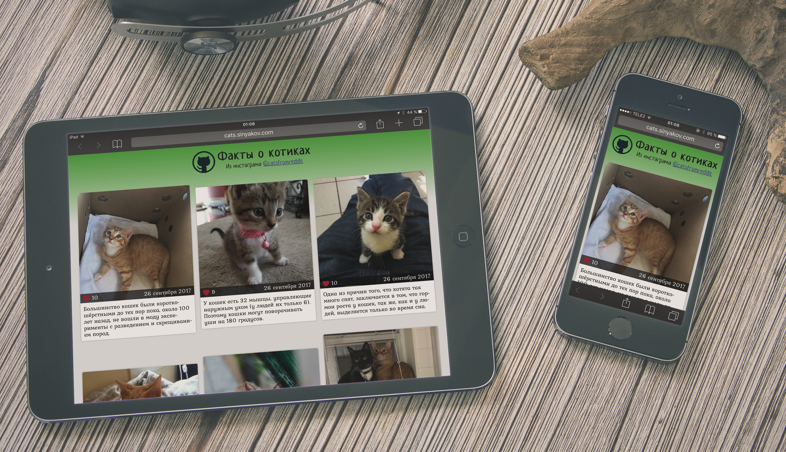

# Тестовое задание для Digital Design

Факты про котиков из инстаграма с [фотографиями из реддита](https://www.reddit.com/r/cats/). Все любят смотреть на котиков и читать реддит :)



## Используемые технологии

- ~~JS~~ [React](https://facebook.github.io/react/)
- ~~HTML & CSS~~ [Styled Components](https://www.styled-components.com) & [Flexbox Grid](http://flexboxgrid.com)
- [JSONP](https://www.npmjs.com/package/jsonp) для получения данных и [Moment.js](https://www.npmjs.com/package/moment) для форматирования дат
- [ESLint](https://eslint.org) & [Travis](https://travis-ci.org) потому что важно не что, а как!

## Как запустить

```bash
git clone git@github.com:sinyakov/instagram-react-client.git
cd instagram-react-client
npm install
npm start
```

Или live-версия: [cats.sinyakov.com](http://cats.sinyakov.com).

## Требование к приложению
- Вверху отображается кнопка загрузить ещё, при нажатии на неё должен происходить запрос к АПИ за новыми данными, после прихода ответа данные должны меняться
- Изображения должны находиться друг под другом (в виде ленты) и должны все иметь одинаковый размер (их можно обрезать)
- Справа от фотографий должно отображаться описание, количество лайков рядом с значком сердечка, и под описанием должна быть дата создания.
- **Дизайн полностью на ваше усмотрение**, но должно выглядеть достойно.
- Загружать и выводить по 20 блоков (фото + описание) за один раз
